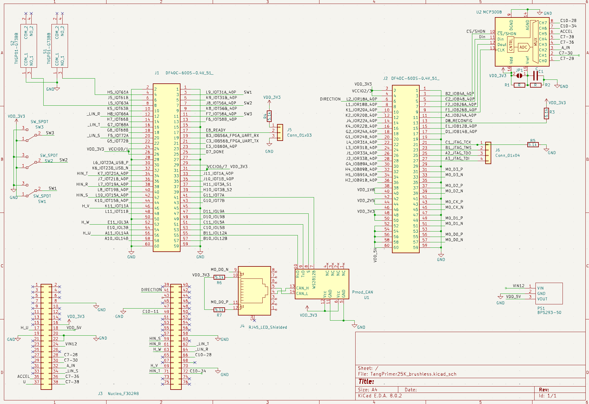

# Overview
 This PCB board was made as a conversion board for Inverter Kit2 that is selling by CQ pub.
 Using this board, you can attach Tang Nano 25K(Sipeed) as an alternative to NUCLEO.
 There's Garber data made by KiCAD.

# BoM
型名 | アイテム（Item）|個数（Quantity）
---|---|---
　| 1608チップコンデンサ1μF | 1
　| 1608チップコンデンサ10μF | 1
　| 1608チップ抵抗220Ω | 8
　| 1608チップ抵抗4.7kΩ | 3
　| 1608チップ抵抗60.4Ω | 2
　| ダブルピンヘッダ（2x19列） | 2
　| JTAG用シングルピンヘッダ（1x4列） | 1
　| ジャンパ用シングルピンヘッダ（1x3列） | 1
　| RJ45ジャック | 1
TJA1441AT | CANトランシーバ | 1
SDCW3216-2-222TF | コモンモードチョークコイル | 1
SM24CANB-02HTG | | 1
TVGP01-G73BB with Gray cap | スイッチ | 2 
MCP3008-I/P | A-Dコンバータ | 1
2MS1-T1-B4-M2-Q-E | トグルスイッチ | 3
BP5293-50 | 5VDCDCコンバータ | 1

# FPGA Design
There's a sample project in sample directory.  
The project is files for Gowin EDA which is IDE for Gowin FPGA.
You can download Gowin EDA without any cost.

# Schematics

